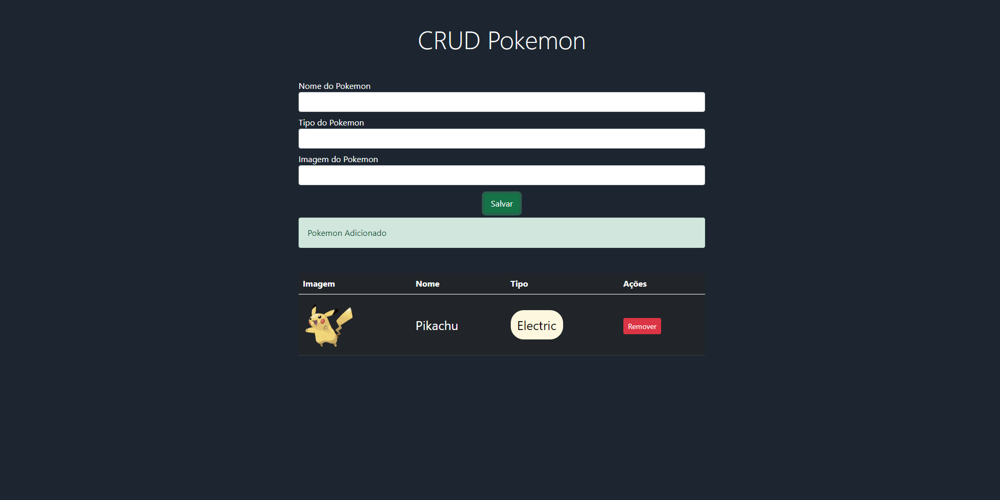
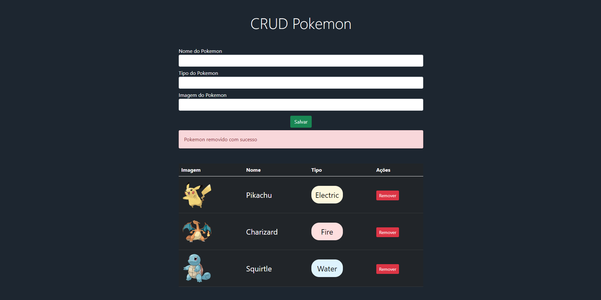

# CRUD POKEMON

Desafio solicitado por Roberto Campos, para o grupo de mentoria TI para a Vida.

Você pode conferir o resultado do deploy mais recente clicando [aqui](https://xbarcos.github.io/crud-pokemon)

### O sistema conta com a possibilidade de poder adicionar e remover pokemons desde o #001 ao #905 da pokedex original.

## Como utilizar
<li>Você pode digitar o nome do pokemon, desde que ele não esteja repetido. Caso aconteça, o sistema soltará um alerta te dizendo que o pokemon já existe na tabela;</li>
<li>Digite o nome do Pokemon independente se estiver em maiúsculo ou minúsculo;</li>
<li>Se você não selecionar nenhum tipo, receberá também uma mensagem de erro</li>
<li>Para procurar as imagens poderá utilizar esse link: https://raw.githubusercontent.com/PokeAPI/sprites/master/sprites/pokemon/other/official-artwork/{numero-pokemon}.png, trocando o {numero-pokemon} pelo número desejado.</li>

## Tecnologias utilizadas:
<li>Javascript</li>
<li>HTML</li>
<li>CSS</li>
<li>Bootstrap</li>
